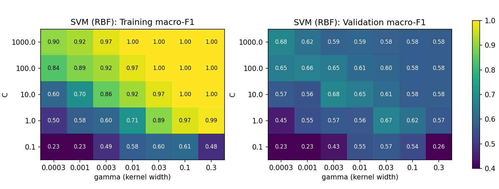
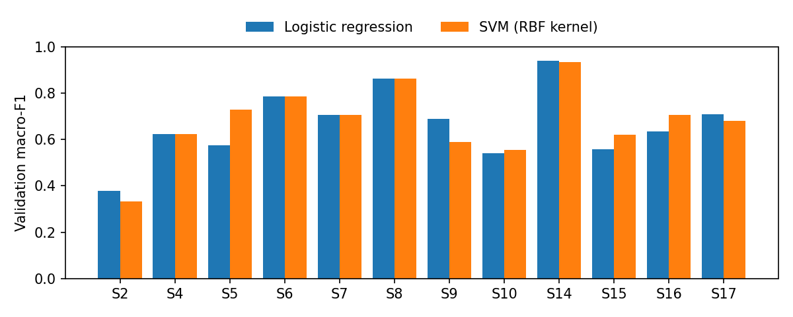

# Detecting Affective States from Wearable Sensor Data

**CS-C3240 Machine Learning — Stage 2 Report**

---

## 1. Introduction

A modern smartwatch can report how many steps its wearer took and how long they slept, but not
whether they had a stressful day. The sensors needed for that are already on the device: heart
activity, skin conductance and body temperature all change measurably with emotional arousal. What
is missing is the step that turns those raw signals into a statement such as "the last hour was a
stressful one".

This project asks whether that step can be automated: **given a short window of physiological
signals recorded by a wearable device, can we predict which affective state the wearer was in?**
The motivation is adaptive user interfaces — a system that can read the user's state is a
prerequisite for one that responds to it, for example by suppressing notifications while the user
is concentrating.

Section 2 formalises this as a supervised classification problem. Section 3 describes the dataset,
the feature construction and selection, the two methods compared (logistic regression and a
support vector machine with an RBF kernel) together with their loss functions, and the construction
of the training, validation and test sets. Section 4 compares the training and validation errors of
both methods, explains the choice of the final method and reports its test error. Section 5
interprets the results and discusses limitations and possible improvements.

---

## 2. Problem Formulation

**Data point.** One data point is a **60-second window** of physiological recordings from a single
subject, extracted with a 30-second stride. Windows overlapping a transition between two
experimental conditions are discarded so that each window carries an unambiguous label.

**Features.** Each data point is described by **19 continuous feature variables**, computed as
summary statistics over the window (details in Section 3.2). They include heart-rate and
heart-rate-variability measures derived from the ECG signal, statistics of the electrodermal
activity (EDA) signal, respiration rate and amplitude, body temperature, and accelerometer-based
motion statistics. All features are real-valued.

**Label.** The label is the experimental condition the subject was in during that window, a
categorical variable with three values: `baseline` (neutral), `stress` (a standardised social
stress test) and `amusement` (watching humorous video clips).

**Task type.** This is a **supervised learning** problem, specifically multi-class classification.
The aim is to learn a predictor that generalises to *subjects not seen during training*, since a
deployed system would have to work on a new user without per-person calibration.

---

## 3. Methods

### 3.1 Dataset

The data comes from **WESAD** (Wearable Stress and Affect Detection), a publicly available research
dataset published by Schmidt et al. [1] and hosted by the University of Siegen. It contains
recordings from 15 subjects wearing a chest-mounted RespiBAN device, which samples ECG,
electrodermal activity, respiration, body temperature, EMG and 3-axis acceleration at 700 Hz. The
three conditions of interest amount to roughly 36 minutes per subject, with per-sample condition
annotations. Each subject also wore a wrist device (Empatica E4), which is not used here.

Preprocessing: the meditation, recovery and undefined segments were removed. Each signal was
filtered once over the whole recording (ECG band-pass 5–15 Hz, EDA low-pass 1 Hz, respiration
band-pass 0.1–0.7 Hz) and then segmented into windows as described in Section 2, yielding
**1042 data points** (566 baseline, 311 stress, 165 amusement). The classes are imbalanced, as the
baseline condition is considerably longer than the amusement condition.

### 3.2 Feature selection

Features were chosen in two steps.

First, **domain knowledge**: emotional arousal is associated with increased heart rate, reduced
heart-rate variability and elevated skin conductance (see [1] and references therein), so the
candidate set was built around signals known to carry that information rather than by taking all
available channels indiscriminately. Accelerometer features were added deliberately, because
physical movement produces artefacts in the autonomic signals; including motion statistics lets the
model account for movement instead of misattributing it to affect. The EMG channel was dropped, as
it mainly reflects local muscle activity. This gave 21 candidate features.

Second, **inspection of the data** on the development subjects only (Section 3.5). A correlation
heatmap of the candidates showed that the mean, minimum and maximum of the EDA signal were
perfectly correlated (r = 1.00 for every pair): within a 60-second window, skin conductance drifts
too little for the extremes to carry information beyond the mean. EDA min and EDA max were therefore
removed, leaving **19 features**. RMSSD and pNN50 were also strongly correlated (r = 0.96) but both
were kept, since they are not identical and the L2 regularisation of both models handles correlated
inputs. Box plots of each feature grouped by condition showed that heart rate, EDA variability and
the number of skin-conductance responses separate the stress class clearly. They also showed that
accelerometer variability is much higher under stress, which likely reflects the physical demands
of the stress protocol (standing and giving a speech) rather than the affective state itself; we
return to this in Section 5.

The final 19 features are:

| Modality | Features |
|---|---|
| ECG | mean heart rate, heart-rate std, SDNN, RMSSD, pNN50 |
| EDA | mean, std, slope, number of skin-conductance responses |
| Respiration | breathing rate, signal std (amplitude) |
| Temperature | mean, std, slope |
| Accelerometer | magnitude mean, magnitude std, per-axis std (x, y, z) |

All features are standardised to zero mean and unit variance, with the scaling parameters computed
on the training split only and then applied unchanged to the validation or test split.

### 3.3 Models

**Logistic regression.** The hypothesis space consists of linear maps from the feature vector
$x \in \mathbb{R}^{19}$ to a vector of three class scores, $Wx + b$, which the softmax function
turns into class probabilities. This model was chosen as the first method for three reasons. It is
the natural starting point for a classification problem with continuous numeric features and no
prior evidence that the decision boundary is strongly non-linear. It has a single hyperparameter,
which matters given the modest number of subjects. And its weights are directly interpretable: the
coefficient on each physiological feature can be compared with what the literature would predict.

**Support vector machine with an RBF kernel.** A linear model cannot represent interactions between
features. Physiologically such interactions are plausible: a rise in heart rate or skin conductance
may indicate stress when the subject is still, but merely physical effort when they are moving. The
box plots in Section 3.2 point the same way, since motion features separate the stress class for
reasons that are partly unrelated to affect. To test whether a non-linear decision boundary
generalises better to new subjects, the second method is an SVM with the radial basis function
(RBF) kernel $K(x, x') = \exp(-\gamma \lVert x - x' \rVert^2)$. Its hypothesis space consists of
functions $h(x) = \sum_i \alpha_i y_i K(x_i, x) + b$, i.e. weighted sums of Gaussian bumps centred on
the training points (the support vectors); the three-class problem is handled by training one
binary SVM per pair of classes and taking a majority vote. The model has two hyperparameters:
**C**, which sets the strength of regularisation (small C gives a smoother, more regularised
boundary), and **γ**, which sets the kernel width (large γ lets the boundary bend around individual
points). For very small γ, an RBF-SVM approaches a linear classifier [2], so this hypothesis space
contains near-linear boundaries as a limit case; the comparison therefore asks whether the extra
flexibility is actually used.

### 3.4 Loss functions

**Logistic regression** is trained by minimising the **logistic loss** (multi-class cross-entropy)
with L2 regularisation, $\tfrac{1}{2}\lVert W \rVert^2 + C \sum_i -\log p(y_i \mid x_i)$. The
logistic loss is the loss for which logistic regression is defined; it is convex and therefore
efficiently minimisable, and it rewards *confident* correct predictions rather than only correct
ones, so the model outputs calibrated class probabilities.

**The SVM** is trained by minimising the **hinge loss** with L2 regularisation. For each pair of
classes, with labels $y_i \in \{-1, +1\}$, the objective is
$\tfrac{1}{2}\lVert w \rVert^2 + C \sum_i \max(0,\, 1 - y_i h(x_i))$. The hinge loss is the loss for
which the SVM is defined and is also convex. It is zero for points classified correctly with a
sufficient margin, so the solution depends only on the points near the boundary, which keeps the
model robust to points far from it. Unlike the logistic loss, it does not yield class
probabilities.

**Evaluation.** Both methods are evaluated with the same measure, so that they can be compared
directly. Because the classes are imbalanced, average 0/1 loss (i.e. accuracy) is misleading: a
predictor that always outputs `baseline` would already reach 54 % accuracy. The validation and test
errors are therefore reported as **1 − macro-F1**, which averages the F1 score over the three
classes with equal weight and so penalises a model that ignores the smallest class. Accuracy is
reported alongside it for comparability with published results [1], together with confusion
matrices.

### 3.5 Training, validation and test sets

The split is made **at the subject level, not at the window level**. Windows from the same subject
are highly correlated, and baseline physiology differs substantially between individuals. Under a
random window-level split, windows from one subject would appear in both training and validation
sets, allowing the model to score well by recognising *who* the subject is rather than *what state
they are in* — an error that inflates the reported performance while telling us nothing about the
intended use case.

**Test set.** Before any model development, 3 of the 15 subjects (S3, S11 and S13, drawn at random
with a fixed seed) were set aside as the test set: **208 data points** (113 baseline, 62 stress, 33
amusement). They were not used for feature selection, training, hyperparameter tuning or model
choice, and were evaluated exactly once, after the final method had been fixed.

**Training and validation sets.** The remaining **12 subjects (834 data points)** form the
development set, on which **leave-one-subject-out (LOSO) cross-validation** is performed. Each of
the 12 folds trains on 11 subjects (≈764 data points) and validates on the single held-out subject
(≈70 data points). Cross-validation was preferred over a single split because the number of
subjects is small: a single validation subject would give an estimate dominated by that
individual's physiology. Averaging over 12 folds uses every development subject for validation
exactly once and also shows how much performance varies from person to person.

**Hyperparameter tuning and model selection.** For each method, every hyperparameter setting in a
grid was scored by its mean LOSO validation macro-F1, and the best setting was kept. The grids were
C ∈ {0.001, 0.01, 0.1, 1, 10, 100} for logistic regression, and C ∈ {0.1, 1, 10, 100, 1000} ×
γ ∈ {0.0003, 0.001, 0.003, 0.01, 0.03, 0.1, 0.3} for the SVM. The two tuned methods were then
compared using a paired variant of the **one-standard-error rule** [3]: the final method is the
simplest one whose mean validation macro-F1 lies within one standard error of the best mean, where
the standard error is that of the per-subject difference between the two methods. This rule was used because the
fold-to-fold spread is large (standard deviation ≈ 0.15 over subjects), so a small difference in
means does not justify preferring a more complex model. Finally, the chosen method was retrained on
all 12 development subjects and evaluated on the test set.

---

## 4. Results

### 4.1 Hyperparameter tuning

For **logistic regression**, small C underfits (training macro-F1 0.555 at C = 0.001), and
validation macro-F1 levels off from C = 0.1 onwards; the best value is **C = 1**.

For the **SVM**, Figure 1 shows the full grid. Large γ produces near-perfect training scores
(training macro-F1 of 0.97–1.00 for γ ≥ 0.1 and C ≥ 1) while validation macro-F1 falls to
0.57–0.63 — a clear case of overfitting to the training subjects. The best validation scores
(0.66–0.68) lie along a diagonal from (C = 1, γ = 0.03) to (C = 1000, γ = 0.0003): the smaller the
kernel width, the larger the C needed. The overall best is **C = 1000, γ = 0.0003**, at a corner of
the grid. The grid was not extended further: in that direction the RBF-SVM approaches a linear
classifier [2], and at this setting its validation score was already identical to that of logistic
regression on 4 of the 12 validation subjects.

*Figure 1. Mean training (left) and LOSO validation (right) macro-F1 of the RBF-SVM over the
hyperparameter grid.*

### 4.2 Comparison and choice of the final method

| Method (best setting) | Training accuracy | Training macro-F1 | Validation accuracy | Validation macro-F1 |
|---|---|---|---|---|
| Logistic regression (C = 1) | 0.917 ± 0.006 | 0.876 ± 0.011 | 0.746 ± 0.131 | 0.667 ± 0.151 |
| RBF-SVM (C = 1000, γ = 0.0003) | 0.930 ± 0.006 | 0.900 ± 0.009 | 0.748 ± 0.133 | 0.677 ± 0.154 |

*Mean ± standard deviation over the 12 LOSO folds. Validation error (1 − macro-F1): 0.333 for
logistic regression, 0.323 for the SVM.*

The two methods perform almost identically. The SVM's mean validation macro-F1 is 0.010 higher, but
the per-subject difference has a standard deviation of 0.063 and a standard error of 0.018; the SVM
is better on 4 subjects, worse on 4 and identical on 4 (Figure 2). Since the difference is smaller
than one standard error, the one-standard-error rule selects the simpler method, **logistic
regression**, as the final method. Two further considerations support this choice: its weights can
be inspected, and the logistic loss provides class probabilities that the hinge loss does not.

*Figure 2. Validation macro-F1 for each held-out development subject.*

For both methods the training error is much smaller than the validation error (training macro-F1
≈ 0.88–0.90 against validation ≈ 0.67), and the validation scores vary widely between subjects,
from 0.38 (S2) to 0.94 (S14) for logistic regression. Since the training scores are stable across
folds while the validation scores are not, the gap reflects differences *between people* rather
than overfitting to individual windows. The more flexible SVM did not reduce this gap: settings that
fit the training subjects more closely generalised worse (Figure 1). The pooled validation confusion
matrix of logistic regression shows that stress is recognised reliably (211 of 249 windows), while
amusement is mostly confused with baseline (59 of 132 amusement windows predicted as baseline, and 91
baseline windows predicted as amusement); both conditions involve low autonomic arousal.

The weights of the final model are largely consistent with the physiology: the largest positive
coefficients for stress are on the number of skin-conductance responses (+2.13), mean heart rate
(+1.03) and EDA slope (+0.91), and the largest negative one is on SDNN (−1.09), i.e. reduced
heart-rate variability. However, the second-largest stress coefficient is on accelerometer
variability (+1.67), indicating that the model partly relies on movement. The coefficients should be
read as indicative only, because several features are correlated: for example, the heart-rate
standard deviation receives a positive stress weight (+0.92) even though the closely related SDNN
receives a negative one.

For context, Schmidt et al. [1] report LOSO results on the same three-class task using all
chest-device modalities: their best linear classifier (linear discriminant analysis) reached 76.5 %
accuracy and a macro-F1 of 72.5 %. Our validation scores (74.6 % and 66.7 %) are somewhat lower but
of a similar magnitude. The comparison is only approximate, because the windowing, the feature set
and the number of training subjects per fold (14 in [1], 11 here) differ. Schmidt et al. also found
that the linear classifier performed on par with tree ensembles, which agrees with our finding that
a non-linear model brings no clear benefit.

### 4.3 Test error of the final method

Logistic regression (C = 1) was retrained on all 834 development windows and evaluated once on the
208 test windows.

| | Accuracy | Macro-F1 |
|---|---|---|
| Training (12 development subjects) | 0.912 | 0.869 |
| **Test (3 held-out subjects)** | **0.837** | **0.730** |

The **test error is 0.270** (1 − macro-F1). Per test subject, macro-F1 was 0.704 (S3), 0.871 (S11)
and 0.567 (S13). Per class, baseline was recognised almost always (recall 0.965), stress mostly
(recall 0.887), but amusement poorly: only 10 of 33 amusement windows were recognised (recall
0.303), although almost every window predicted as amusement was correct (precision 0.909).

| True \ Predicted | baseline | stress | amusement |
|---|---|---|---|
| baseline | 109 | 3 | 1 |
| stress | 7 | 55 | 0 |
| amusement | 8 | 15 | 10 |

The test score is higher than the mean validation score (0.730 against 0.667). This should not be
read as the model performing better than expected. With only 3 test subjects, the test score is
itself very uncertain: given the between-subject standard deviation of 0.151 observed in
validation, the mean over 3 subjects has a standard error of about 0.09, and the observed
difference lies well within it. The test set happened to include S11, an easy subject, and the
per-subject test scores (0.57–0.87) fall within the range of the validation scores (0.38–0.94). The
test result is therefore consistent with the validation estimate.

---

## 5. Conclusion

We formulated affective-state detection from a chest-worn sensor as a three-class classification
problem, extracted 19 physiological and motion features from 60-second windows, and compared
L2-regularised logistic regression with an RBF-kernel SVM using leave-one-subject-out
cross-validation. The two methods reached almost the same validation macro-F1 (0.667 and 0.677);
the simpler logistic regression was chosen and reached a test macro-F1 of 0.730 (test error 0.270)
on three unseen subjects.

The problem is only partly solved. Baseline and stress are recognised reliably, but amusement is
not: the model rarely predicts it, and it is confused with baseline in validation and with stress
in the test set. The test subject S13 illustrates one cause. All 11 of its amusement windows were
classified as stress, even though S13 completed the amusement condition *before* the stress test,
so a carry-over of stress can be ruled out. During amusement, S13's accelerometer variability and
respiration amplitude were as high as or higher than is typical for stress in the development set,
while it showed few skin-conductance responses. This is consistent with motion acting as a confounding
feature: because the stress protocol involves standing and speaking, the model has partly learned
"more movement means stress". Schmidt et al. [1] showed that motion features alone score far below
physiological features, so the model does not rely on motion alone; but a single subject who moves
a lot can still be misclassified.

The main limitation is not model flexibility but the variation between people. Training scores were
stable while validation scores ranged from 0.38 to 0.94 between subjects, and the more flexible SVM
only overfitted the training subjects. With 11 training subjects per fold, it is hard to learn
patterns that hold for every new person. Large-scale wearable studies support this view: for a
wrist-worn EMG interface, Kaifosh et al. [5] trained on data from 162 to 6,627 participants
depending on the task and observed reliable performance improvements as the number of training
participants increased. We did not test this directly on WESAD, but it suggests that more subjects
would help more than a more complex model. Further limitations are that the labels are experimental
conditions rather than measured affective states, so a subject who did not feel stressed during
the stress test is mislabelled by construction, and that the test set of three subjects gives only
a rough estimate of performance.

Several directions could improve the method:

- **Per-subject feature normalisation**, e.g. expressing each feature relative to the subject's own
  baseline, would remove person-level offsets such as S13's elevated resting heart rate. It would,
  however, require a short calibration recording from each new user, relaxing the no-calibration
  assumption of Section 2.
- **Class weighting** in the training loss would counter the imbalance and raise amusement recall,
  at the cost of some precision.
- **Features that separate movement from arousal**, for example EDA responses that are not
  accompanied by movement, or discarding high-motion windows, would reduce the motion confound.
- **More subjects**, and a learning curve over the number of training subjects to test whether
  performance is still improving with more data.

---

## Use of AI

Generative AI was used throughout this project: Claude (Anthropic, used through the Claude Code
coding assistant) and Gemini 3.1 Pro. The choice of the WESAD dataset, the formulation of the
classification problem, the use of logistic regression as the baseline method, and the content to
be covered in each section of this report were decided by the author.

- **Code.** All Python code was written by Claude: signal filtering and R-peak detection, windowing
  and feature extraction, leave-one-subject-out cross-validation and hyperparameter tuning of both
  methods, the test-set evaluation, and all figures. Claude also organised the project files and
  fixed the Git repository configuration.
- **Methodological suggestions.** Claude recommended the RBF-SVM as the second method (adopted by
  the author), proposed removing EDA min/max after the correlation analysis, extended the SVM grid
  when the first optimum lay on the grid boundary, and proposed the one-standard-error rule for
  choosing between the methods. The rule was fixed before the test set was evaluated.
- **Analysis.** Claude identified the collinear features and the motion confound in the
  exploratory plots, analysed the confusion matrices, and carried out the per-subject analysis of
  test subject S13 (confusion matrix, protocol order and feature profile). Claude also looked up
  the comparison results in [1] and the participant numbers in [5] from the original papers.
- **Writing.** The text of this report was drafted by Claude from the author's outline of what each
  section should contain, and revised by the author.

The author reviewed the code, the results and the final text, and takes responsibility for the
content of this report.

---

## 6. References

[1] P. Schmidt, A. Reiss, R. Duerichen, C. Marberger and K. Van Laerhoven, "Introducing WESAD, a
Multimodal Dataset for Wearable Stress and Affect Detection," in *Proceedings of the 20th ACM
International Conference on Multimodal Interaction (ICMI)*, 2018, pp. 400–408.

[2] S. S. Keerthi and C.-J. Lin, "Asymptotic behaviors of support vector machines with Gaussian
kernel," *Neural Computation*, vol. 15, no. 7, pp. 1667–1689, 2003.

[3] T. Hastie, R. Tibshirani and J. Friedman, *The Elements of Statistical Learning*, 2nd ed.
Springer, 2009, Section 7.10.

[4] F. Pedregosa et al., "Scikit-learn: Machine Learning in Python," *Journal of Machine Learning
Research*, vol. 12, pp. 2825–2830, 2011.

[5] P. Kaifosh, T. R. Reardon and CTRL-labs at Reality Labs, "A generic non-invasive neuromotor
interface for human-computer interaction," *Nature*, vol. 645, pp. 702–711, 2025.

---

## 7. Appendix

All models were implemented with scikit-learn [4]. The code consists of four Python scripts, run
in this order:

| File | Purpose |
|---|---|
| `common.py` | Shared settings: paths, labels, the two models and their hyperparameter grids, and the subject-level train/test split |
| `extract_features.py` | Raw WESAD recordings → one row of 19 features (plus the 2 removed candidates) per window |
| `compare_models.py` | LOSO tuning and comparison of both methods on the 12 development subjects; applies the selection rule; produces the figures |
| `evaluate_test.py` | Retrains the chosen method on all development subjects and evaluates it once on the 3 test subjects |

Code: `[TODO: anonymised repository link, or the name of the attached code file]`
